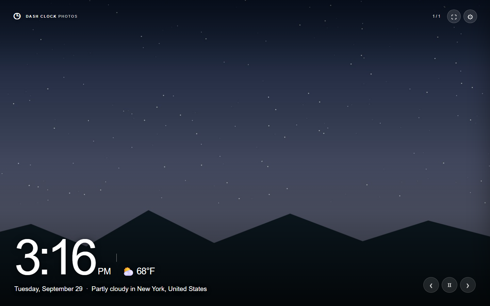
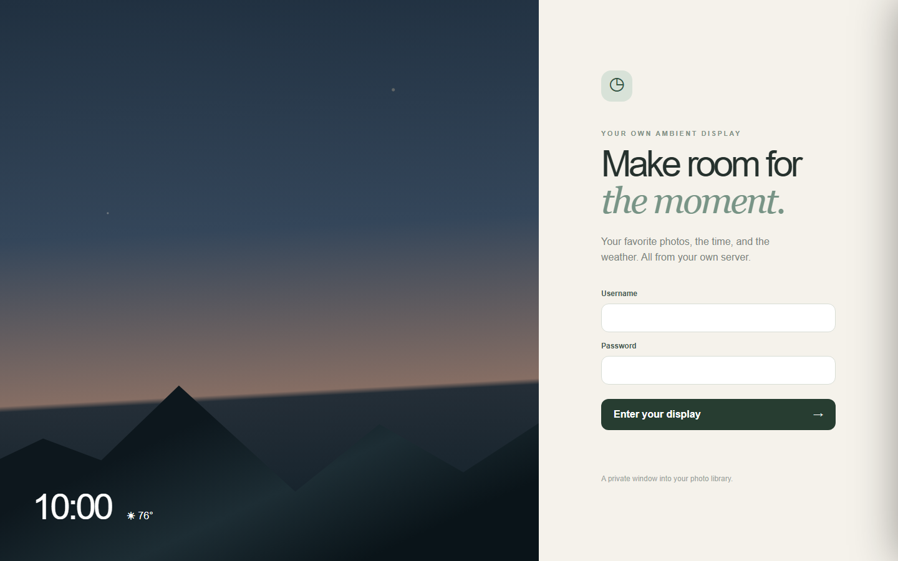
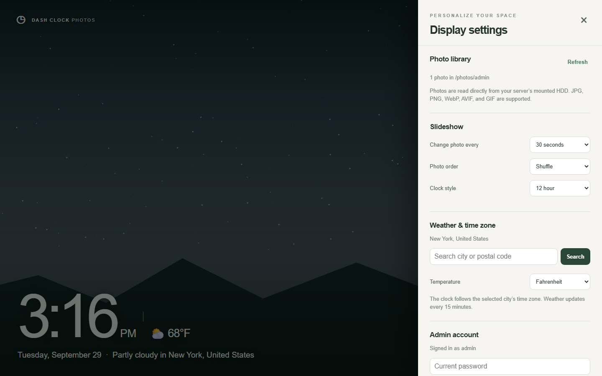
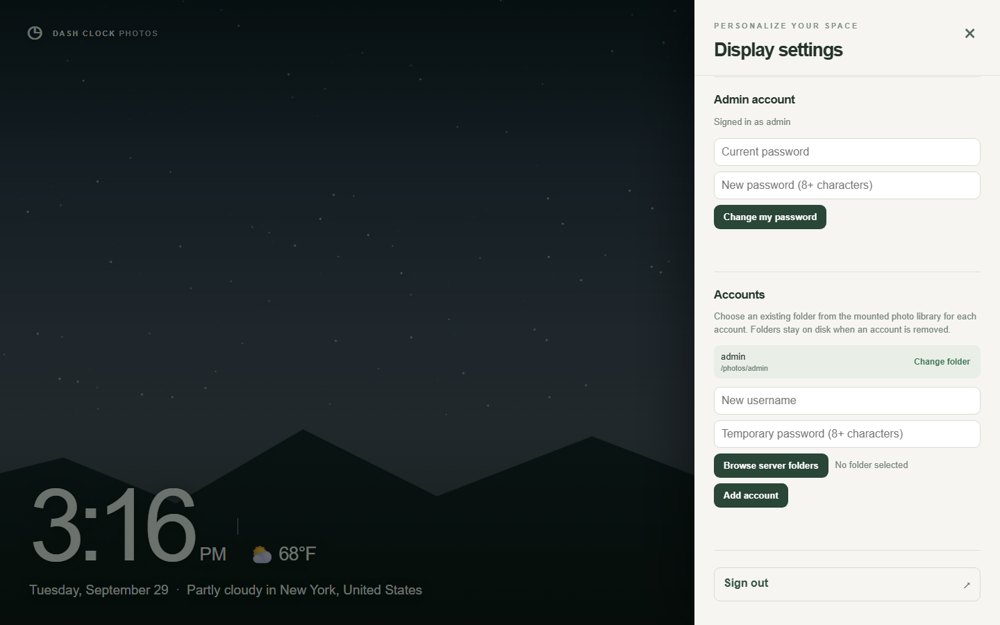

# Dash Clock Photos

A private, self-hosted photo frame inspired by [DashClock](https://github.com/nikunjsingh93/dash_clock) and an ambient smart display. Full-screen photos rotate behind a large clock, date, and current temperature. Each login sees only its own folder on your Ubuntu server's HDD. DashClock is a browser-side Angular PWA; this project adds a separate Node server for accounts and protected photo delivery. The Docker/GHCR deployment follows the pattern used by [OnDevice Film Lab](https://github.com/nikunjsingh93/ondevice-film-lab).

## Screenshots

These captures use a demo account, sample photo, and illustrative New York weather.



| Sign in | Display settings |
| --- | --- |
|  |  |



## MVP features

- Full-screen photo slideshow with shuffle/newest order, interval, pause, next/previous, and keyboard controls. Photos fit within the screen without cropping; unused space is black.
- The server creates 1080p WebP display copies (up to 1920 × 1080, preserving aspect ratio) and serves those to the browser instead of full-resolution originals. The first request reads the HDD and writes a copy under `/state/previews`; later requests use the SSD cache. Photos are not uploaded to a third-party service.
- Current time and date in the selected city's time zone, with 12/24-hour choice.
- Per-account night clock: the default sleep time is 12:00 AM, when the screen turns black and shows a centered white clock with weather underneath. Photos resume at 6:00 AM. Each account can change its sleep time, clock and weather font sizes, and the clock/weather position in Settings. Choosing 6:00 AM as the sleep time keeps the slideshow on all day.
- Current temperature from [Open-Meteo](https://open-meteo.com/en/docs), cached by the backend for 15 minutes. City search uses [Open-Meteo geocoding](https://open-meteo.com/en/docs/geocoding-api). Weather needs internet access from the container; photos and account data stay on your server.
- Administrator-created accounts. Each account maps to a selected folder under `/photos`, and photo URLs require that account's signed login cookie. The HDD is mounted read only. Account deletion leaves photos on disk.
- Administrators choose each account's existing photo folder from an in-app browser of the mounted server drive. Only administrators can change or reset passwords; the minimum password length is eight characters.
- Docker Compose for local builds; a separate Portainer stack for the image published to GitHub Container Registry.

## Ubuntu setup

1. Choose an existing photo root. If several drives are mounted under `/media/wvx`, use `/media/wvx` as the root so the admin can browse each drive and select an account-specific folder. Check that the drives are mounted before starting the container:

   ```bash
   ls -la /media/wvx
   findmnt -rn -o TARGET | grep '^/media/wvx/'
   ```

   No marker file is needed. The app checks that the configured photo root directory exists, but `/media/wvx` can exist while its drives are unmounted. If the drives do not mount automatically after reboot, leave the container stopped and start it manually in Portainer once they are mounted. The container runs as UID `10001` and needs read access to the chosen photo folders. Supported formats are JPG/JPEG, PNG, WebP, AVIF, and GIF; HEIC/RAW need conversion to a browser-supported format.

2. Create state storage on the Ubuntu SSD or another local Linux filesystem. For example, alongside other apps in `dockerApps`:

   ```bash
   sudo mkdir -p /home/wvx/Documents/dockerApps/dash-clock-photos/state
   sudo chown 10001:10001 /home/wvx/Documents/dockerApps/dash-clock-photos/state
   sudo chmod 700 /home/wvx/Documents/dockerApps/dash-clock-photos/state
   ```

3. In Portainer, create a Git stack from `https://github.com/nikunjsingh93/dash-clock-photos.git`, branch `main`, Compose path `compose.prod.yaml`. Enter these stack environment variables, choosing a unique password of at least eight characters:

   ```ini
   DASH_ADMIN_USERNAME=admin
   DASH_ADMIN_PASSWORD=your-own-unique-password
   DASH_PORT=3080
   DASH_PHOTOS_PATH=/media/wvx
   DASH_STATE_PATH=/home/wvx/Documents/dockerApps/dash-clock-photos/state
   ```

   Leave Portainer's GitOps automatic updates disabled so the stack starts only when you choose to deploy or start it. Deploy the stack after the drives are mounted. Open `http://UBUNTU-IP:3080`, sign in, then use **Settings → Accounts → Change folder** to select the admin's drive and photo folder. The health endpoint is `/api/health`. The bootstrap password is used **only to create the first account**; later password changes happen in the app. Existing account state lives in `/state/users.json`.

4. The Compose files use `restart: "no"`. After a server reboot, mount the drives and then manually start the stopped container in Portainer. If a drive was mounted only after the container started and is not visible in the folder browser, recreate the container with **Pull and redeploy** after the drive is mounted.

To add another account, first create a folder on the mounted HDD. Sign in as admin, use **Settings → Accounts → Browse server folders**, select that folder, and create the account. You can later change any account's folder or reset a non-admin password there. Use **Refresh** in Settings to rescan photos without restarting.

The folder browser shows directories already mounted inside the container as `/photos`. A web browser's native folder picker would select a folder on the viewing device and cannot change Docker's host mount. The host HDD root must therefore be mounted once in the Compose/Portainer configuration. Account-specific folders are then selected inside the app.

## New GitHub repository and image

This folder is an independent project, with `origin` set to the `nikunjsingh93/dash-clock-photos` repository. The included workflow builds and pushes `ghcr.io/nikunjsingh93/dash-clock-photos:latest` on each push to `main`. The GitHub package may initially be private; make it public in package settings or give your Ubuntu/Portainer host GHCR credentials.

For Portainer, add a Git stack pointing at this repository, branch `main`, Compose path `compose.prod.yaml`, and set `DASH_ADMIN_USERNAME`, `DASH_ADMIN_PASSWORD`, `DASH_PORT`, `DASH_PHOTOS_PATH`, and `DASH_STATE_PATH`. The last two are Docker host mount paths, not account folders. The production stack pulls the GHCR image. To update after a push, pull and redeploy with image re-pull enabled. If you rename the GitHub repository, update the `image:` in `compose.prod.yaml`.

## Local development

For local Docker, `compose.yaml` mounts `./photos` read only and `./state` read/write by default. These folders have different purposes: `photos` holds the images and account subfolders; `state` holds account password hashes, weather and display settings, the session signing key, and generated preview copies. Do not place `state` on an external drive that may disappear. Create `photos/admin` and `state`, set the admin credentials in `.env`, then run `docker compose up -d --build`.

For a direct Node run, use Node 22+, run `npm ci`, set `ADMIN_USERNAME=admin` and `ADMIN_PASSWORD` to an 8+ character value, then run `npm start`. On PowerShell, set those environment variables with `$env:ADMIN_USERNAME='admin'` and `$env:ADMIN_PASSWORD='...'` first. Run `npm test` for the API isolation and preview checks.

## Security and backups

Use this directly on a trusted LAN only. For remote access, put it behind HTTPS (for example Tailscale Serve or an HTTPS reverse proxy), set `COOKIE_SECURE=true`, and avoid public port forwarding. User passwords are salted with scrypt; cookies are signed and HTTP-only. Back up `users.json` and `session.key` from the state folder along with the HDD folders; generated previews can be rebuilt. Keep `.env` out of Git. The photo drive is mounted read only by the container.

The app reads up to 10,000 photo records per account per refresh. Preview files are generated as photos are viewed, so a large library can take time to warm and will use SSD space. You can remove only the generated `previews` subfolder from app state while the container is stopped; it will be rebuilt on demand. Do not remove `users.json` or `session.key`. Very large libraries or RAW workflows would benefit from a persistent photo index in a later version.
